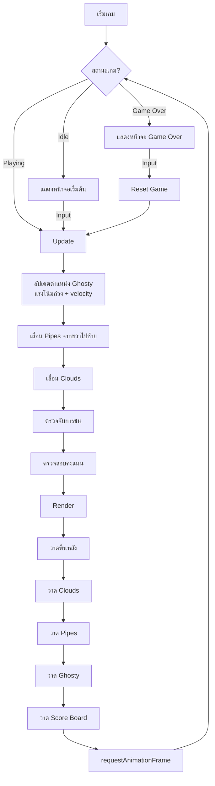
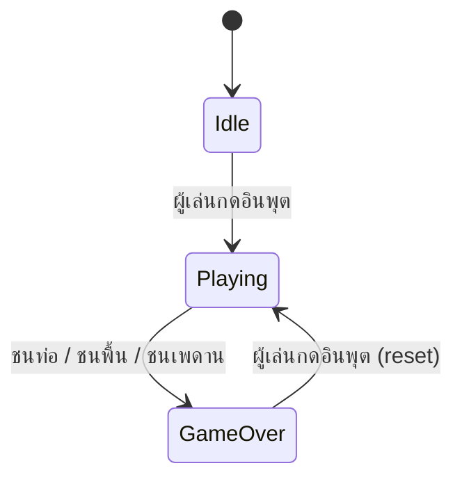

# เอกสารออกแบบ (Design Document) — Flappy Kiro

## ภาพรวม (Overview)

Flappy Kiro เป็นเกม endless scroller สไตล์เรโทรที่รันบนเบราว์เซอร์ด้วย HTML5 Canvas ล้วนๆ (vanilla HTML/CSS/JS ไม่ใช้ framework) ผู้เล่นควบคุมตัวละครผี "Ghosty" ให้บินหลบท่อสีเขียวที่เลื่อนเข้ามาจากด้านขวา โดยมีก้อนเมฆ semi-transparent เป็น decoration บนพื้นหลัง

เกมมี 3 สถานะหลัก: Idle (รอเริ่ม), Playing (กำลังเล่น), Game Over (จบเกม) พร้อมระบบคะแนนที่บันทึก high score ลง localStorage และเอฟเฟกต์เสียง jump/game over

### เป้าหมายการออกแบบ

- โค้ดเรียบง่าย อ่านง่าย ใช้ vanilla JS ไฟล์เดียวหรือน้อยไฟล์ที่สุด
- Game loop ใช้ `requestAnimationFrame` เพื่อความลื่นไหล
- รองรับ input หลายรูปแบบ (เมาส์, touch, keyboard)
- แยก logic ออกจาก rendering เพื่อให้ทดสอบได้

## สถาปัตยกรรม (Architecture)

### โครงสร้างไฟล์

```
index.html          — หน้าเว็บหลัก โหลด canvas และ script
game.js             — โค้ดเกมทั้งหมด (game loop, entities, rendering)
assets/
  ghosty.png        — สไปรท์ตัวละคร Ghosty
  jump.wav          — เสียงกระโดด
  game_over.wav     — เสียง game over
```

### Game Loop Architecture



### State Machine




## คอมโพเนนต์และอินเทอร์เฟซ (Components and Interfaces)

### 1. Game Engine (ตัวจัดการหลัก)

ตัวจัดการ game loop, สถานะเกม, และการประสานงานระหว่างคอมโพเนนต์ทั้งหมด

```javascript
// สถานะเกม
const GameState = {
  IDLE: 'idle',
  PLAYING: 'playing',
  GAME_OVER: 'gameOver'
};

// ฟังก์ชันหลัก
function initGame()        // เริ่มต้นเกม โหลด assets, ตั้งค่า canvas
function gameLoop(timestamp) // main loop ผ่าน requestAnimationFrame
function update(deltaTime)   // อัปเดต logic ทุกเฟรม
function render()            // วาดทุกอย่างลง canvas
function resetGame()         // รีเซ็ตสถานะเกมเพื่อเริ่มใหม่
```

### 2. Ghosty (ตัวละครผู้เล่น)

จัดการตำแหน่ง, velocity, แรงโน้มถ่วง, และการกระโดดของตัวละคร

```javascript
// อินเทอร์เฟซ Ghosty
{
  x: number,          // ตำแหน่งแนวนอน (คงที่)
  y: number,          // ตำแหน่งแนวตั้ง
  width: number,      // ความกว้างสำหรับ bounding box
  height: number,     // ความสูงสำหรับ bounding box
  velocity: number,   // ความเร็วแนวตั้ง (บวก = ลง, ลบ = ขึ้น)
  image: HTMLImageElement
}

function updateGhosty(ghosty, deltaTime, gravity)  // อัปเดตตำแหน่งตามแรงโน้มถ่วง
function flapGhosty(ghosty, flapStrength)           // ให้แรงกระโดดขึ้น
function clampGhosty(ghosty, canvasHeight, scoreBarHeight) // จำกัดตำแหน่งในขอบเขต
```

### 3. Pipe System (ระบบท่อ)

จัดการการสร้าง, เลื่อน, และลบท่อ

```javascript
// อินเทอร์เฟซ PipePair
{
  x: number,          // ตำแหน่งแนวนอน
  gapY: number,       // ตำแหน่งกลางช่องว่าง
  gapHeight: number,  // ความสูงช่องว่าง
  width: number,      // ความกว้างท่อ
  capWidth: number,   // ความกว้างหัวท่อ
  capHeight: number,  // ความสูงหัวท่อ
  scored: boolean     // ผ่านไปแล้วหรือยัง (สำหรับนับคะแนน)
}

function createPipe(canvasWidth, canvasHeight, gapHeight) // สร้างท่อใหม่
function updatePipes(pipes, speed, deltaTime)              // เลื่อนท่อทั้งหมด
function removeOffscreenPipes(pipes)                       // ลบท่อที่ออกนอกจอ
function renderPipe(ctx, pipe, canvasHeight)                // วาดท่อพร้อมหัวท่อ
```

### 4. Collision Detector (ตรวจจับการชน)

ตรวจจับการชนระหว่าง Ghosty กับท่อ, พื้น, และเพดาน

```javascript
function checkCollision(ghosty, pipes, canvasHeight, scoreBarHeight) // ตรวจสอบการชนทั้งหมด
function boxesOverlap(a, b)  // ตรวจสอบ bounding box ซ้อนทับกัน
// a, b = { x, y, width, height }
```

### 5. Score Board (กระดานคะแนน)

จัดการคะแนนปัจจุบัน, high score, และการบันทึก/โหลดจาก localStorage

```javascript
function createScoreBoard()          // สร้าง score board พร้อมโหลด high score
function incrementScore(scoreBoard)  // เพิ่มคะแนน +1
function updateHighScore(scoreBoard) // อัปเดต high score ถ้าคะแนนปัจจุบันสูงกว่า
function saveHighScore(highScore)    // บันทึกลง localStorage
function loadHighScore()             // โหลดจาก localStorage
function resetScore(scoreBoard)      // รีเซ็ตคะแนนปัจจุบันเป็น 0
function renderScoreBoard(ctx, scoreBoard, canvasWidth, canvasHeight) // วาดแถบคะแนน
```

### 6. Cloud System (ระบบเมฆ)

จัดการก้อนเมฆ decoration บนพื้นหลัง

```javascript
// อินเทอร์เฟซ Cloud
{
  x: number,        // ตำแหน่งแนวนอน
  y: number,        // ตำแหน่งแนวตั้ง
  width: number,    // ความกว้าง
  height: number,   // ความสูง
  speed: number,    // ความเร็วเลื่อน (ช้ากว่าท่อ)
  opacity: number   // ค่าความโปร่งใส (0.0 - 1.0)
}

function createCloud(canvasWidth, canvasHeight)     // สร้างเมฆใหม่
function updateClouds(clouds, deltaTime, canvasWidth, canvasHeight) // เลื่อนเมฆ + recycle
function renderCloud(ctx, cloud)                     // วาดเมฆมุมมน
```

### 7. Audio Manager (จัดการเสียง)

จัดการ preload และเล่นเอฟเฟกต์เสียง

```javascript
function createAudioManager()        // สร้าง audio manager, preload เสียง
function playJumpSound(audioManager)  // เล่นเสียงกระโดด
function playGameOverSound(audioManager) // เล่นเสียง game over
```

### 8. Input Handler (จัดการอินพุต)

รับอินพุตจากผู้เล่นและส่งต่อไปยัง game engine ตามสถานะเกม

```javascript
function setupInputHandlers(canvas, onInput) // ลงทะเบียน event listeners
// onInput callback จะถูกเรียกเมื่อมี click, touch, หรือ spacebar
// Game engine จะตัดสินใจว่าจะทำอะไรตามสถานะเกมปัจจุบัน
```

## โมเดลข้อมูล (Data Models)

### Game State

```javascript
const gameState = {
  state: GameState.IDLE,    // สถานะปัจจุบัน: 'idle' | 'playing' | 'gameOver'
  ghosty: {                 // ตัวละครผู้เล่น
    x: 80,
    y: 0,                   // จะถูกตั้งค่าตอน init ให้อยู่กลาง canvas
    width: 40,
    height: 40,
    velocity: 0,
    image: null             // HTMLImageElement โหลดจาก assets/ghosty.png
  },
  pipes: [],                // Array ของ PipePair
  clouds: [],               // Array ของ Cloud
  scoreBoard: {
    score: 0,               // คะแนนปัจจุบัน
    highScore: 0            // คะแนนสูงสุด (โหลดจาก localStorage)
  },
  audioManager: {
    jumpSound: null,        // Audio object สำหรับ jump.wav
    gameOverSound: null     // Audio object สำหรับ game_over.wav
  }
};
```

### ค่าคงที่ของเกม (Game Constants)

```javascript
const CONFIG = {
  // ฟิสิกส์
  GRAVITY: 0.5,             // แรงโน้มถ่วง (pixels/frame²)
  FLAP_STRENGTH: -8,        // แรงกระโดด (ค่าลบ = ขึ้น)
  
  // ท่อ
  PIPE_WIDTH: 60,           // ความกว้างท่อ
  PIPE_GAP: 150,            // ความสูงช่องว่างระหว่างท่อบน-ล่าง
  PIPE_SPEED: 3,            // ความเร็วเลื่อนท่อ (pixels/frame)
  PIPE_SPAWN_INTERVAL: 1500, // ระยะเวลาสร้างท่อใหม่ (ms)
  PIPE_CAP_HEIGHT: 20,      // ความสูงหัวท่อ
  PIPE_CAP_OVERHANG: 5,     // ส่วนยื่นของหัวท่อแต่ละข้าง
  
  // เมฆ
  CLOUD_MIN_SPEED: 0.3,     // ความเร็วเมฆต่ำสุด
  CLOUD_MAX_SPEED: 1.2,     // ความเร็วเมฆสูงสุด
  CLOUD_MIN_OPACITY: 0.15,  // ค่า opacity ต่ำสุด (เมฆไกล)
  CLOUD_MAX_OPACITY: 0.5,   // ค่า opacity สูงสุด (เมฆใกล้)
  CLOUD_COUNT: 5,           // จำนวนเมฆเริ่มต้น
  
  // กระดานคะแนน
  SCORE_BAR_HEIGHT: 40,     // ความสูงแถบคะแนนด้านล่าง
  HIGH_SCORE_KEY: 'flappyKiroHighScore', // key สำหรับ localStorage
  
  // สี
  BG_COLOR: '#87CEEB',      // สีพื้นหลังฟ้าอ่อน
  PIPE_COLOR: '#2E8B57',    // สีท่อเขียว
  PIPE_CAP_COLOR: '#3CB371', // สีหัวท่อ
  SCORE_BAR_BG: 'rgba(0, 0, 0, 0.7)' // พื้นหลังแถบคะแนน
};
```

### localStorage Schema

| Key | Type | คำอธิบาย |
|-----|------|----------|
| `flappyKiroHighScore` | `string` (ตัวเลข) | คะแนนสูงสุดที่เคยทำได้ แปลงเป็น number ด้วย `parseInt()` |

### การตัดสินใจออกแบบ (Design Decisions)

1. **ไฟล์เดียว (game.js)**: เนื่องจากเป็นเกมขนาดเล็ก การรวมโค้ดไว้ในไฟล์เดียวช่วยลดความซับซ้อนและไม่ต้องใช้ module bundler แต่แยก function ชัดเจนเพื่อให้ทดสอบได้

2. **Pure functions สำหรับ logic**: ฟังก์ชัน update, collision detection, และ scoring เป็น pure functions ที่รับ state เข้าและคืน state ใหม่ ทำให้ทดสอบได้ง่ายโดยไม่ต้องพึ่ง DOM

3. **Bounding box collision**: ใช้ AABB (Axis-Aligned Bounding Box) สำหรับตรวจจับการชน เพราะเพียงพอสำหรับเกมแนวนี้และคำนวณเร็ว

4. **Cloud opacity ตามความเร็ว**: เมฆที่เคลื่อนที่ช้ากว่าจะมี opacity ต่ำกว่า สร้างเอฟเฟกต์ parallax/perspective โดยไม่ต้องใช้ layer หลายชั้น

5. **Delta time**: ใช้ delta time จาก `requestAnimationFrame` timestamp เพื่อให้เกมทำงานสม่ำเสมอบนทุก frame rate


## คุณสมบัติความถูกต้อง (Correctness Properties)

*Property คือคุณลักษณะหรือพฤติกรรมที่ควรเป็นจริงในทุกการทำงานที่ถูกต้องของระบบ — เป็นข้อความเชิงรูปนัยเกี่ยวกับสิ่งที่ระบบควรทำ Properties ทำหน้าที่เป็นสะพานเชื่อมระหว่าง specification ที่มนุษย์อ่านได้กับการรับประกันความถูกต้องที่เครื่องตรวจสอบได้*

### Property 1: แรงโน้มถ่วงเพิ่ม velocity ลงเสมอ

*สำหรับทุก* สถานะของ Ghosty (ค่า y และ velocity ใดๆ) เมื่อ updateGhosty ถูกเรียกหนึ่งเฟรม velocity หลัง update ควรเท่ากับ velocity เดิมบวกค่า gravity เสมอ

**Validates: Requirements 2.2**

### Property 2: Flap ตั้งค่า velocity เป็นค่าลบ

*สำหรับทุก* ค่า velocity เริ่มต้นของ Ghosty เมื่อ flapGhosty ถูกเรียก velocity หลัง flap ควรเท่ากับค่า flapStrength (ค่าลบ) เสมอ

**Validates: Requirements 2.3**

### Property 3: Clamp จำกัด Ghosty ในขอบเขต Canvas

*สำหรับทุก* ค่า y ของ Ghosty (รวมค่าที่เกินขอบเขต) และทุกค่า canvasHeight เมื่อ clampGhosty ถูกเรียก ค่า y ผลลัพธ์ต้องอยู่ระหว่าง 0 ถึง canvasHeight - scoreBarHeight - ghosty.height เสมอ

**Validates: Requirements 2.4**

### Property 4: State machine transitions ถูกต้อง

*สำหรับทุก* อินพุตที่เกิดขึ้น: ถ้าสถานะปัจจุบันเป็น Idle ผลลัพธ์ต้องเป็น Playing, ถ้าสถานะปัจจุบันเป็น Playing และเกิดการชน ผลลัพธ์ต้องเป็น Game Over, และถ้าสถานะปัจจุบันเป็น Game Over ผลลัพธ์ต้องเป็น Playing (reset)

**Validates: Requirements 3.4, 9.2, 9.3, 9.4**

### Property 5: Pipe gap อยู่ในขอบเขตที่เล่นได้

*สำหรับทุก* ค่า canvasHeight ที่สุ่มมา เมื่อ createPipe ถูกเรียก ค่า gapY ของ pipe ที่สร้างขึ้นต้องอยู่ในขอบเขตที่ทำให้ทั้งท่อบน (gapY - gapHeight/2 > 0) และท่อล่าง (gapY + gapHeight/2 < canvasHeight - scoreBarHeight) มองเห็นได้

**Validates: Requirements 4.1, 4.5**

### Property 6: Pipe เลื่อนซ้ายตาม speed

*สำหรับทุก* pipe และทุกค่า speed และ deltaTime เมื่อ updatePipes ถูกเรียก ค่า x ของทุก pipe ควรลดลงเท่ากับ speed * deltaTime

**Validates: Requirements 4.3**

### Property 7: Pipe นอกจอถูกลบออก

*สำหรับทุก* array ของ pipes ที่มีตำแหน่งต่างๆ เมื่อ removeOffscreenPipes ถูกเรียก ไม่ควรมี pipe ที่มี x + width < 0 เหลืออยู่ใน array และ pipe ที่ยังอยู่ในจอต้องไม่ถูกลบ

**Validates: Requirements 4.4**

### Property 8: Bounding box collision detection ถูกต้อง

*สำหรับทุก* คู่ของ bounding box (a, b) ที่มีตำแหน่งและขนาดสุ่ม boxesOverlap(a, b) ควรคืน true ก็ต่อเมื่อ a.x < b.x + b.width AND a.x + a.width > b.x AND a.y < b.y + b.height AND a.y + a.height > b.y (เงื่อนไข AABB overlap มาตรฐาน)

**Validates: Requirements 5.1, 5.4**

### Property 9: คะแนนเพิ่มขึ้นทีละ 1

*สำหรับทุก* ค่าคะแนนเริ่มต้น เมื่อ incrementScore ถูกเรียก คะแนนผลลัพธ์ต้องเท่ากับคะแนนเดิมบวก 1 เสมอ

**Validates: Requirements 6.1**

### Property 10: High score เป็นค่า max เสมอ

*สำหรับทุก* คู่ (score, highScore) เมื่อ updateHighScore ถูกเรียก ค่า highScore ผลลัพธ์ต้องเท่ากับ Math.max(score, highScore) เสมอ

**Validates: Requirements 6.3**

### Property 11: High score round trip ผ่าน localStorage

*สำหรับทุก* ค่า highScore ที่เป็นจำนวนเต็มไม่ติดลบ เมื่อ saveHighScore แล้ว loadHighScore ควรได้ค่าเดิมกลับมา

**Validates: Requirements 6.4**

### Property 12: Reset คะแนนเป็น 0 และคง high score

*สำหรับทุก* สถานะ scoreBoard ที่มี score และ highScore ใดๆ เมื่อ resetScore ถูกเรียก score ต้องเป็น 0 และ highScore ต้องไม่เปลี่ยนแปลง

**Validates: Requirements 6.5**

### Property 13: Cloud opacity สัมพันธ์กับความเร็ว และน้อยกว่า 1

*สำหรับทุก* คู่ของ cloud (A, B) ถ้า cloud A มีความเร็วน้อยกว่า cloud B แล้ว opacity ของ A ต้องน้อยกว่าหรือเท่ากับ opacity ของ B และ opacity ของทุก cloud ต้องอยู่ในช่วง (0, 1) ไม่รวม 1

**Validates: Requirements 8.1, 8.4**

### Property 14: Cloud เคลื่อนที่ช้ากว่า Pipe

*สำหรับทุก* cloud ที่สร้างขึ้น ความเร็วของ cloud ต้องน้อยกว่าความเร็วของ pipe (PIPE_SPEED) เสมอ

**Validates: Requirements 8.3**

### Property 15: จำนวน Cloud คงที่หลัง update

*สำหรับทุก* array ของ clouds และทุกค่า canvasWidth/canvasHeight เมื่อ updateClouds ถูกเรียก จำนวน cloud ใน array ต้องเท่าเดิมเสมอ (เมฆที่ออกนอกจอถูกแทนที่ด้วยเมฆใหม่)

**Validates: Requirements 8.5**


## การจัดการข้อผิดพลาด (Error Handling)

### Asset Loading

- **รูปภาพ Ghosty โหลดไม่สำเร็จ**: แสดง fallback เป็นวงกลมสีขาวแทนรูปภาพ เกมยังเล่นได้
- **ไฟล์เสียงโหลดไม่สำเร็จ**: เกมทำงานต่อได้โดยไม่มีเสียง ใช้ try-catch ครอบการเล่นเสียงทุกครั้ง

### localStorage

- **localStorage ไม่พร้อมใช้งาน** (เช่น private browsing mode): ใช้ try-catch ครอบ getItem/setItem ถ้าล้มเหลวให้ใช้ค่า 0 เป็น high score และไม่บันทึก
- **ค่าใน localStorage เสียหาย**: ถ้า parseInt ได้ NaN ให้ใช้ค่า 0

### Canvas

- **Canvas context ไม่พร้อมใช้งาน**: ตรวจสอบ getContext('2d') ถ้าได้ null ให้แสดงข้อความแจ้งผู้ใช้ว่าเบราว์เซอร์ไม่รองรับ

### Audio Playback

- **เบราว์เซอร์บล็อก autoplay**: เสียงจะเล่นได้หลังจากผู้ใช้ interact กับหน้าเว็บครั้งแรก (click/touch/keypress) ซึ่งเป็นพฤติกรรมปกติของเกมนี้อยู่แล้ว เพราะต้องกดเพื่อเริ่มเกม
- **Audio play() ล้มเหลว**: ใช้ .catch() จัดการ promise rejection จาก play() โดยไม่ให้กระทบ gameplay

## กลยุทธ์การทดสอบ (Testing Strategy)

### แนวทางการทดสอบแบบคู่ (Dual Testing Approach)

เกมนี้ใช้การทดสอบ 2 แบบร่วมกัน:

1. **Unit Tests**: ทดสอบตัวอย่างเฉพาะ, edge cases, และ error conditions
2. **Property-Based Tests**: ทดสอบ universal properties ข้ามทุก input ที่เป็นไปได้

ทั้งสองแบบเสริมกัน — unit tests จับ bug เฉพาะจุด, property tests ตรวจสอบความถูกต้องทั่วไป

### เครื่องมือทดสอบ

- **Test Runner**: Vitest (เร็ว, รองรับ ESM, ใช้กับ vanilla JS ได้ดี)
- **Property-Based Testing Library**: fast-check (ไลบรารี PBT ยอดนิยมสำหรับ JavaScript)
- **ทุก property test ต้องรันอย่างน้อย 100 iterations**

### โครงสร้างไฟล์ทดสอบ

```
tests/
  ghosty.test.js        — ทดสอบ physics ของ Ghosty (Property 1, 2, 3)
  state.test.js          — ทดสอบ state machine (Property 4)
  pipes.test.js          — ทดสอบระบบท่อ (Property 5, 6, 7)
  collision.test.js      — ทดสอบ collision detection (Property 8)
  score.test.js          — ทดสอบระบบคะแนน (Property 9, 10, 11, 12)
  clouds.test.js         — ทดสอบระบบเมฆ (Property 13, 14, 15)
```

### Property-Based Tests

ทุก property test ต้อง:
- รันอย่างน้อย 100 iterations (ค่าเริ่มต้นของ fast-check)
- มี comment อ้างอิง property จาก design document
- ใช้ format: `// Feature: flappy-kiro, Property {number}: {property_text}`
- แต่ละ correctness property ต้องถูก implement ด้วย property-based test เดียว

### Unit Tests

Unit tests ควรเน้น:
- Edge cases: Ghosty ที่ขอบเขต canvas, pipe ที่ตำแหน่ง 0, คะแนน 0
- Error conditions: localStorage ไม่พร้อมใช้งาน, ค่าเสียหาย
- Integration: การทำงานร่วมกันระหว่าง scoring กับ pipe passing
- ตัวอย่างเฉพาะ: collision กับพื้น (5.2), collision กับเพดาน (5.3)

### สิ่งที่ไม่ทดสอบด้วย automated tests

- Visual rendering (สี, สไตล์, ตำแหน่งบนหน้าจอ)
- Audio playback
- DOM event handling (click, touch, keypress)
- requestAnimationFrame behavior
- Canvas drawing operations

สิ่งเหล่านี้ต้องทดสอบด้วย manual testing บนเบราว์เซอร์จริง
