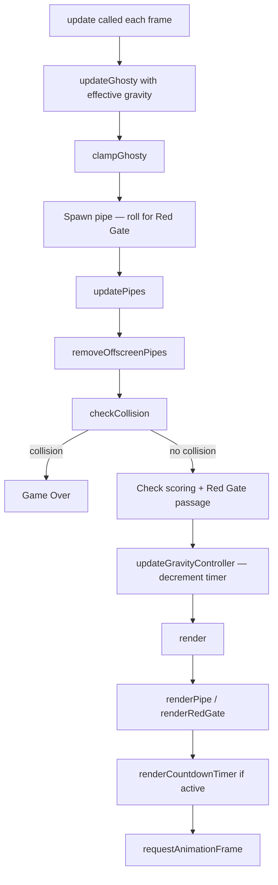
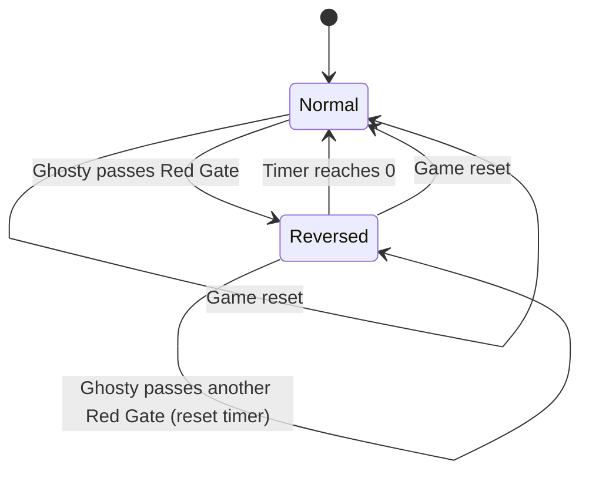

# Design Document — Impossible Mode

## Overview

Impossible Mode extends Flappy Kiro with a gravity reversal mechanic. A special Red Gate (red-colored pipe pair) spawns occasionally in place of a normal green pipe. When Ghosty passes through a Red Gate, gravity reverses for 10 seconds — Ghosty floats upward and flap pushes downward. A countdown timer displays in the top-left corner during reverse gravity. Passing through another Red Gate while reversed resets the timer to 10 seconds.

All new logic lives in `game.js` alongside existing code, following the same patterns: pure functions for logic, mutation for game objects, CONFIG constants for tuning, and conditional `module.exports` for Vitest testing.

### Design Goals

- Minimal changes to existing functions — extend rather than rewrite
- New `gravityController` object tracks gravity state and timer
- Red Gate is a PipePair with an `isRedGate: true` flag — no new entity type
- All new constants added to the existing CONFIG object
- New functions follow the same pure-function-where-possible pattern

## Architecture

### Modified Game Loop Flow



### Gravity State Machine



## Components and Interfaces

### 1. Gravity Controller (new)

Manages gravity direction and the reversal countdown timer.

```javascript
// Interface
{
  reversed: boolean,    // true = gravity pulls upward
  timer: number         // seconds remaining (0 when normal)
}

function createGravityController()                          // returns { reversed: false, timer: 0 }
function activateReverseGravity(gc, duration)               // sets reversed=true, timer=duration
function updateGravityController(gc, deltaTime)             // decrements timer, restores normal at 0
function resetGravityController(gc)                         // resets to normal state
function getEffectiveGravity(gc, baseGravity)               // returns -baseGravity if reversed, else baseGravity
function getEffectiveFlapStrength(gc, baseFlapStrength)      // returns -baseFlapStrength if reversed, else baseFlapStrength
function getTimerDisplay(gc)                                // returns ceiling of timer as integer, or 0
```

### 2. Red Gate Spawning (extends Pipe System)

Red Gates reuse the PipePair structure with an added flag.

```javascript
// Extended PipePair interface
{
  x: number,
  gapY: number,
  gapHeight: number,
  width: number,
  capWidth: number,
  capHeight: number,
  scored: boolean,
  isRedGate: boolean    // NEW — true for Red Gates, false for normal pipes
}

function createRedGate(canvasWidth, canvasHeight, gapHeight, scoreBarHeight)
// Same as createPipe but returns { ...pipe, isRedGate: true }

function shouldSpawnRedGate(probability)
// Returns true with the given probability (0.0 to 1.0)
```

### 3. Countdown Timer Rendering (new)

```javascript
function renderCountdownTimer(ctx, gravityController)
// Renders timer in top-left corner when reversed is true
// Uses CONFIG.TIMER_FONT_SIZE, CONFIG.TIMER_COLOR, CONFIG.TIMER_X, CONFIG.TIMER_Y
```

### 4. Red Gate Rendering (extends renderPipe)

```javascript
function renderPipe(ctx, pipe, canvasHeight, scoreBarHeight)
// MODIFIED — checks pipe.isRedGate to choose red or green color scheme
```

### 5. Modified Existing Functions

| Function | Change |
|----------|--------|
| `update()` | Use `getEffectiveGravity()` instead of `CONFIG.GRAVITY`. Call `updateGravityController()`. Check Red Gate passage to activate reverse gravity. Use `getEffectiveFlapStrength()` for flap. |
| `handleInput()` | Pass effective flap strength from gravity controller. |
| `resetGame()` (inside initGame) | Call `resetGravityController()`. |
| `render()` | Call `renderCountdownTimer()` when gravity is reversed. |
| `createPipe()` / pipe spawning | Roll `shouldSpawnRedGate()` to decide pipe type. |
| `module.exports` | Add all new functions to exports. |


## Data Models

### Gravity Controller State

```javascript
const gravityController = {
  reversed: false,   // gravity direction: false=normal (down), true=reversed (up)
  timer: 0           // seconds remaining of reverse gravity (0 = inactive)
};
```

### New CONFIG Constants

```javascript
// Added to existing CONFIG object
{
  // Red Gate
  RED_GATE_PROBABILITY: 0.15,        // 15% chance each pipe spawn is a Red Gate
  REVERSE_GRAVITY_DURATION: 10,      // seconds of reverse gravity

  // Red Gate colors
  RED_GATE_COLOR: '#B22222',         // firebrick red for pipe body
  RED_GATE_CAP_COLOR: '#DC143C',     // crimson for pipe cap

  // Countdown timer
  TIMER_FONT_SIZE: 28,              // px
  TIMER_COLOR: '#FF4444',           // red text
  TIMER_X: 16,                      // px from left edge
  TIMER_Y: 36                       // px from top edge
}
```

### Extended Game State

```javascript
const game = {
  // ... existing fields unchanged ...
  gravityController: {
    reversed: false,
    timer: 0
  }
};
```

### Design Decisions

1. **`isRedGate` flag on PipePair**: Rather than creating a separate entity type, Red Gates are PipePairs with `isRedGate: true`. This means all existing pipe logic (movement, collision, removal, scoring) works unchanged. Only rendering and passage detection need to check the flag.

2. **Gravity Controller as separate object**: Keeping gravity state in its own object (not scattered across game state) makes it easy to reset, test, and reason about. Functions like `getEffectiveGravity()` and `getEffectiveFlapStrength()` are pure — they take the controller and a base value, return the effective value.

3. **Timer in seconds, not frames**: Using real seconds (decremented by deltaTime) ensures the 10-second duration is frame-rate independent, consistent with the existing deltaTime-based game loop.

4. **`shouldSpawnRedGate()` as pure function**: Takes probability, returns boolean. This makes it testable and the probability configurable via CONFIG. The randomness is isolated to this one call.

5. **Rendering Red Gate in `renderPipe()`**: Instead of a separate render function, the existing `renderPipe()` checks `isRedGate` and picks the appropriate color constants. This avoids duplicating the pipe drawing logic.

6. **Timer clamped to zero**: `updateGravityController()` clamps the timer to 0 if it goes negative (e.g., from a large deltaTime spike), then restores normal gravity. This handles the edge case from Requirement 7.1.

7. **Red Gates spawn during reverse gravity**: Per Requirement 1.5, there's no restriction on spawning Red Gates while reversed. Passing through another Red Gate just resets the timer (Requirement 2.2).


## Correctness Properties

*A property is a characteristic or behavior that should hold true across all valid executions of a system — essentially, a formal statement about what the system should do. Properties serve as the bridge between human-readable specifications and machine-verifiable correctness guarantees.*

### Property 1: Red Gate structural invariants

*For any* canvasWidth, canvasHeight, and scoreBarHeight within valid ranges, a Red Gate created by `createRedGate()` must have `isRedGate === true`, `gapHeight` equal to `CONFIG.PIPE_GAP`, and `gapY` within the playable vertical bounds (gapY - gapHeight/2 > 0 and gapY + gapHeight/2 < canvasHeight - scoreBarHeight).

**Validates: Requirements 1.1, 1.3, 1.4**

### Property 2: Activate reverse gravity sets state correctly

*For any* gravity controller (regardless of current reversed/timer state) and any positive duration, calling `activateReverseGravity(gc, duration)` must result in `gc.reversed === true` and `gc.timer === duration`.

**Validates: Requirements 2.1, 2.2**

### Property 3: Effective gravity reflects reversal state

*For any* positive base gravity value, `getEffectiveGravity(gc, baseGravity)` must return `-baseGravity` when `gc.reversed` is true, and `baseGravity` when `gc.reversed` is false.

**Validates: Requirements 2.3, 4.2**

### Property 4: Effective flap strength reflects reversal state

*For any* negative base flap strength value, `getEffectiveFlapStrength(gc, baseFlapStrength)` must return `-baseFlapStrength` when `gc.reversed` is true, and `baseFlapStrength` when `gc.reversed` is false.

**Validates: Requirements 2.4, 4.3**

### Property 5: Timer display is ceiling of remaining seconds

*For any* gravity controller with `timer > 0`, `getTimerDisplay(gc)` must return `Math.ceil(gc.timer)`. When `timer` is 0, it must return 0.

**Validates: Requirements 3.2, 3.4**

### Property 6: Timer expiry restores normal gravity

*For any* gravity controller with `reversed === true` and `timer > 0`, after calling `updateGravityController(gc, deltaTime)` with a `deltaTime >= timer`, the result must have `reversed === false` and `timer === 0` (clamped, never negative).

**Validates: Requirements 4.1, 7.1**

### Property 7: Reset gravity controller restores initial state

*For any* gravity controller state (any combination of reversed and timer values), calling `resetGravityController(gc)` must result in `gc.reversed === false` and `gc.timer === 0`.

**Validates: Requirements 6.1, 6.2**

## Error Handling

### Large Delta Time Spikes

- `updateGravityController()` clamps the timer to 0 if decrementing would make it negative. This prevents the timer from going below zero due to frame rate drops or tab-backgrounding. When clamped to 0, gravity is immediately restored to normal.

### Ghosty Position After Gravity Restoration

- When gravity switches from reversed to normal, Ghosty may be near the ceiling (y ≈ 0). The existing `clampGhosty()` already constrains Ghosty to `[0, canvasHeight - scoreBarHeight - ghosty.height]`, so no additional handling is needed. The collision check runs after clamping, so Ghosty won't be in an invalid position.

### Red Gate with Zero Probability

- If `RED_GATE_PROBABILITY` is set to 0, `shouldSpawnRedGate(0)` always returns false — no Red Gates spawn. The game plays as normal Flappy Kiro. If set to 1, every pipe is a Red Gate.

### Audio During Reverse Gravity

- No new audio is introduced. Existing jump and game over sounds play unchanged. The `playJumpSound` call doesn't depend on gravity state.

## Testing Strategy

### Dual Testing Approach

This feature uses the same dual testing approach as the base game:

1. **Unit Tests**: Specific examples, edge cases, error conditions
2. **Property-Based Tests**: Universal properties across all inputs using fast-check

Both are complementary — unit tests catch concrete bugs, property tests verify general correctness.

### Tools

- **Test Runner**: Vitest (already configured)
- **Property-Based Testing Library**: fast-check (already a dependency)
- **Minimum 100 iterations per property test** (fast-check default)

### Test File Structure

```
tests/
  gravity.test.js          — Gravity controller tests (Property 2, 3, 4, 5, 6, 7)
  red-gate.test.js         — Red Gate spawning tests (Property 1)
```

### Property-Based Tests

Each property test must:
- Run at least 100 iterations (fast-check default)
- Include a comment referencing the design property
- Use format: `// Feature: impossible-mode, Property {number}: {property_text}`
- Each correctness property is implemented by a single property-based test

### Unit Tests

Unit tests should cover:
- `createGravityController()` returns correct initial state (Requirement 6.3)
- `shouldSpawnRedGate(0)` always returns false, `shouldSpawnRedGate(1)` always returns true
- Timer display edge cases: timer at exactly 1.0, timer at 0.001 (should display 1), timer at 0
- `updateGravityController` with deltaTime that exactly equals remaining timer
- Integration: Red Gate passage triggers gravity reversal in the update loop
- `renderPipe` uses red colors for Red Gates (verify fillStyle if ctx is mockable)

### What NOT to Test with Automated Tests

- Visual appearance of Red Gate colors on canvas
- Countdown timer font/position aesthetics
- Gameplay feel of reversed controls
- Audio behavior during reverse gravity

These require manual playtesting.
